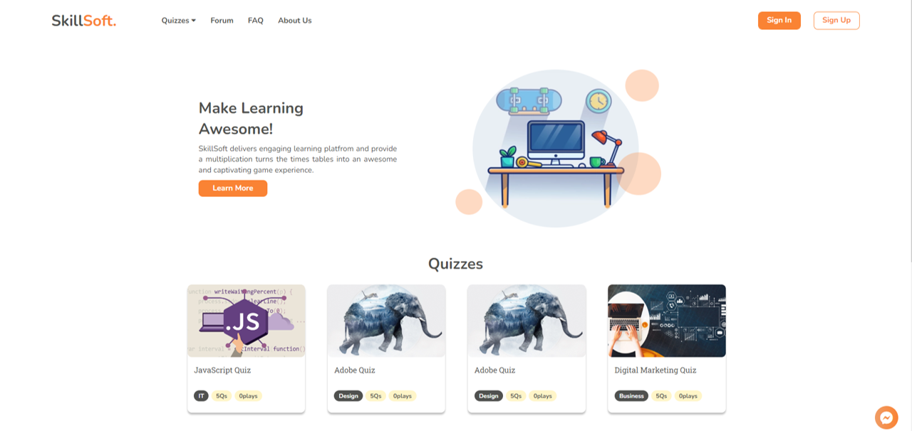

# Online-Learning-System
This is a web and mobile responsive online learning website which provides quizzes to students, similarly like Kahoot. Website is coded in PHP, SQL, HTML, CSS, JavaScript, AJAX & jQuery.
  
* Student
    •	Login or create an account
•	Verify account through registered email
•	Retrieve forgotten password through registered email
•	Answer quizzes
•	Retrieve result once completed a quiz
•	Create and post any questions in the discussion room 
•	Reattempt quizzes
•	Utilize chatbot feature
•	Logout from account
 
* Teacher 
    •	Login into account
• View profile
•	Create a quiz with questions and answers
• Edit quiz information
• Delete a quiz
• View and answer questions in the discussion room 
•	Analyze student's quiz results
•	Modify menu price
• Update daily sales
• Update chatbot system
•	Logout from account

* Admin
    •	Login into account
•	Add user accounts
• View admin dashboard
• Approve or reject teacher's account
•	Manage users
• Manage chatbot
•	Logout from account

## Getting Started
1. Install  [WAMP](https://www.wampserver.com/en/download-wampserver-64bits/) for MySQL server.

2. Import  [skillsoft.sql](/Online-Learning-System/database/skillsoft.sql) to phpMyAdmin. 

3. Run the program using local host in default browser.

4. Enter localhost/Online-Learning-System 

## Screenshot

-----

  <h2>Landing Page</h2>

-----

  <h2>Login Page</h2>

-----

  <h2>User Roles</h2>

-----

  <h2>Menu</h2>

-----

  <h2>Shopping Cart</h2>

-----

  <h2>Checkout</h2>

-----

  <h2>Order Status & History</h2>

